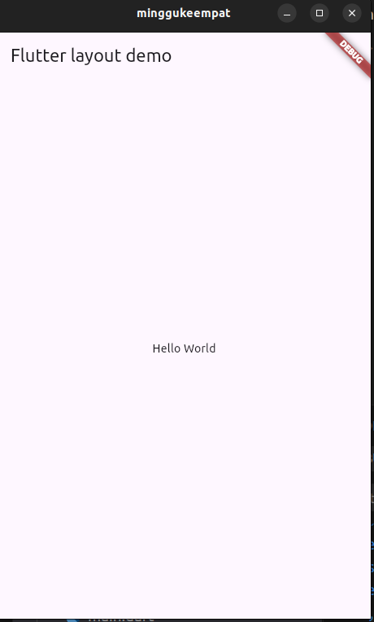
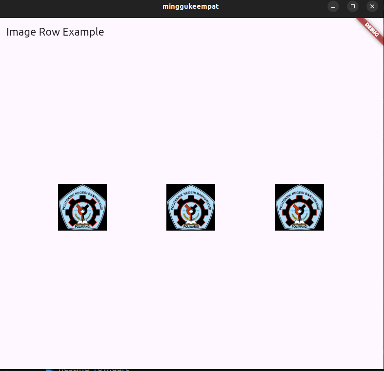
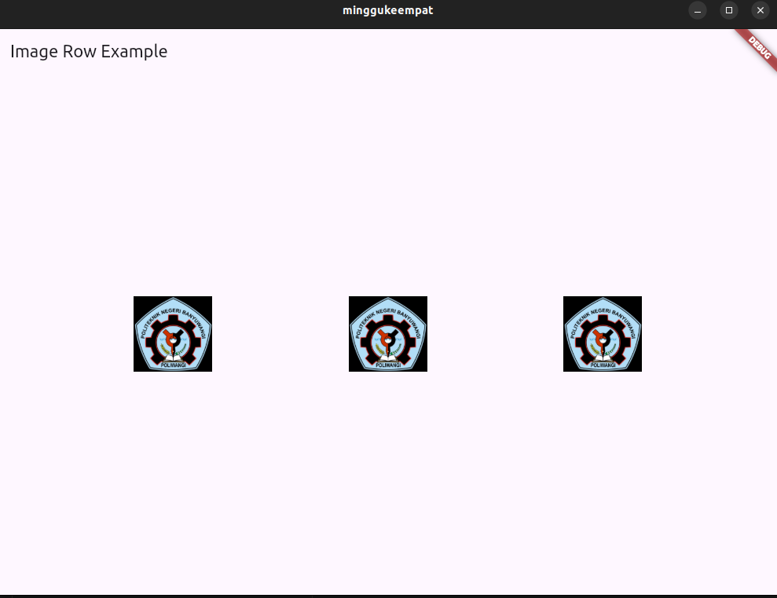
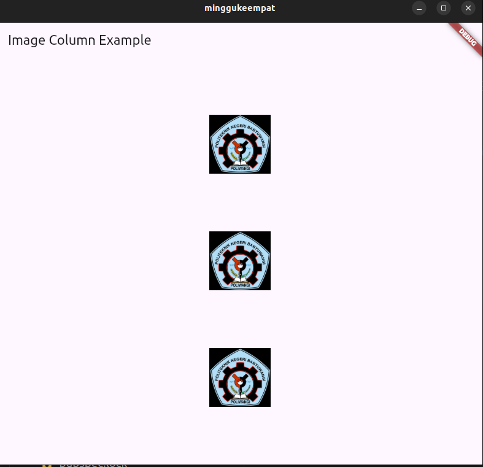
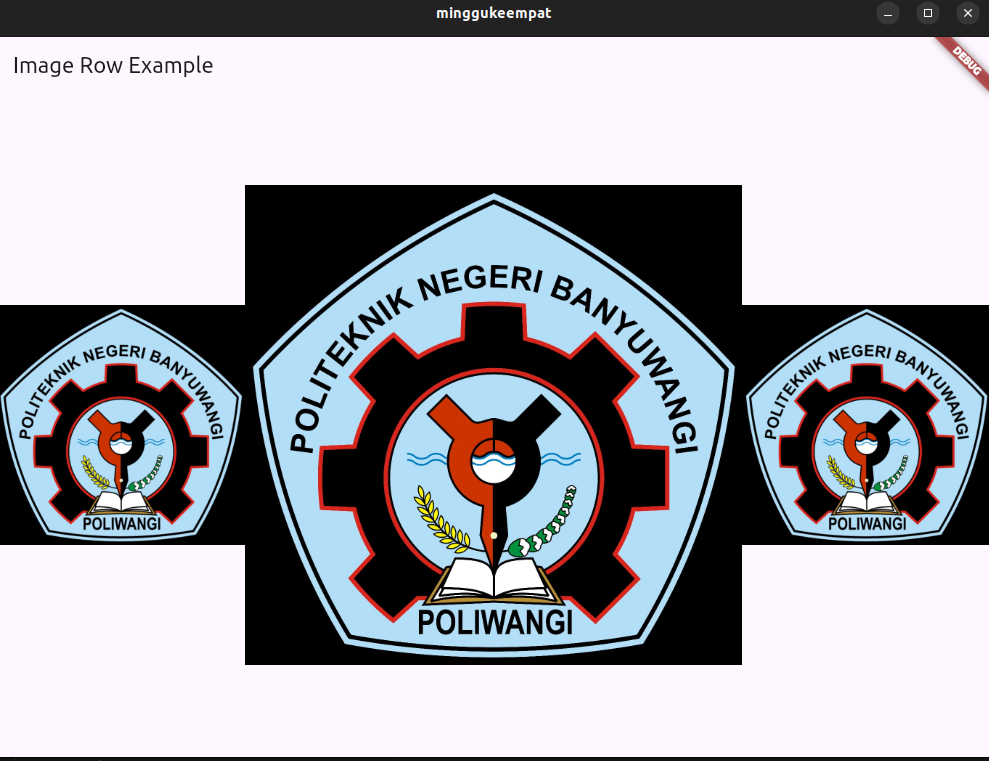
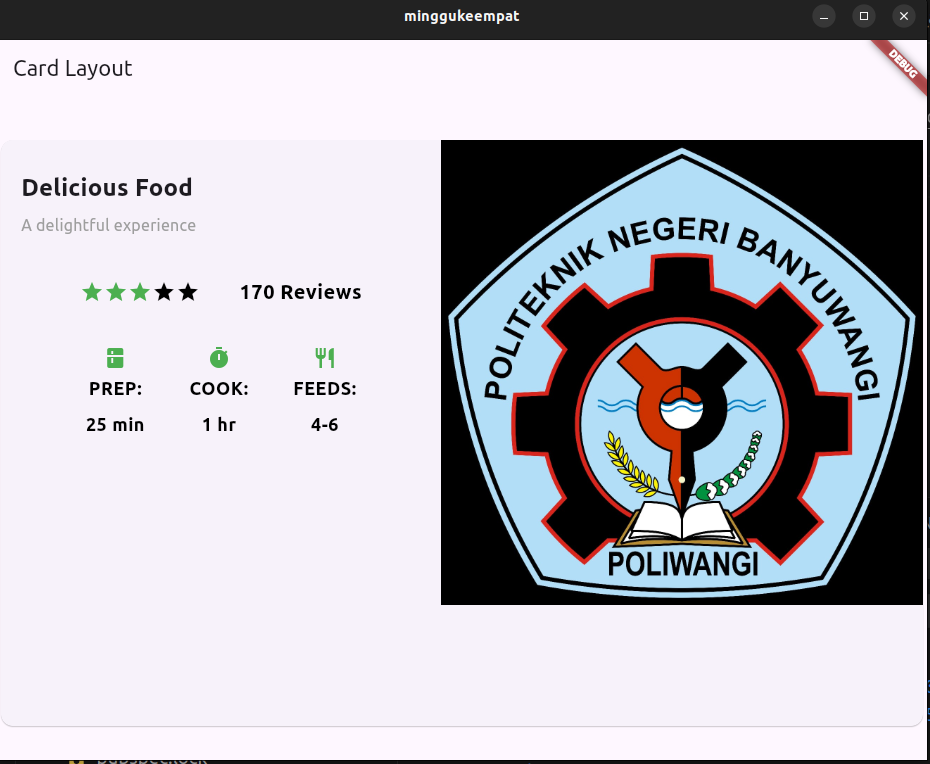
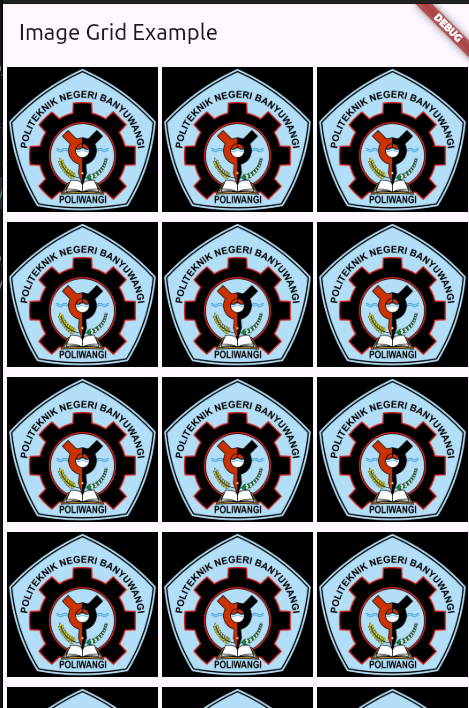
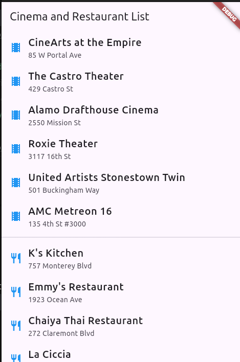
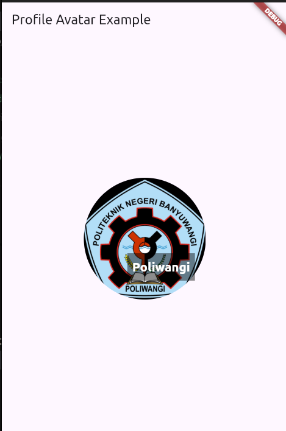
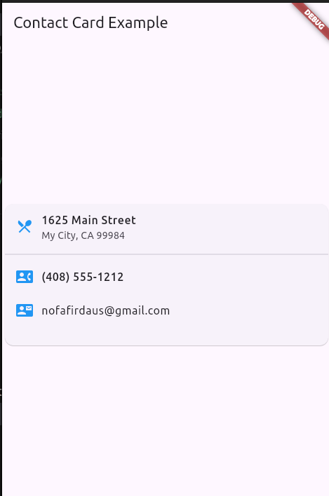

- **Create a visible widget**

- **Add the layout widget to the page**

**Cupertino apps**
code : 
[cuppertino_app.dart](lib/widgets/cupertino_app.dart)

- **Aligning widgets**

**Row**

**Column**

- **Sizing widgets**
**Expanded**

**Flex**

- **Nesting rows and columns**

- **Grid**

- **List View**

- **Stack**

- **Card**
